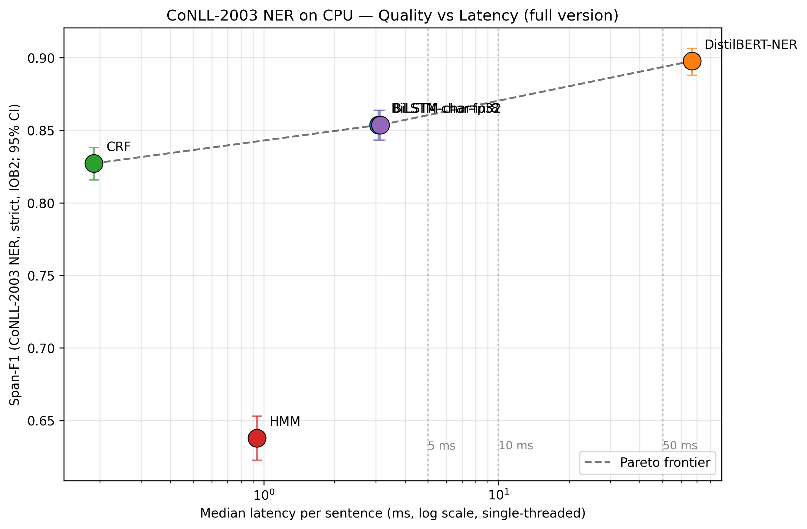
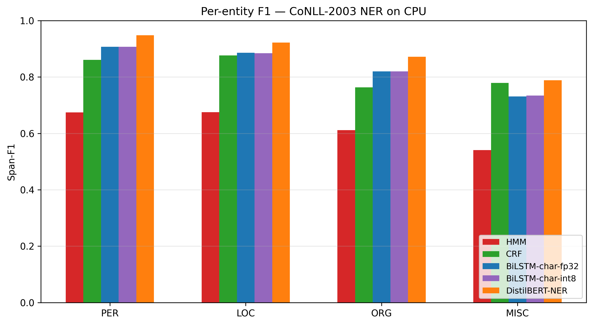

# Case Study 4.9 — Latency-Constrained Sequence Labelling on CPU (FULL version)

**Task:** Named Entity Recognition on CoNLL-2003 (synalp .txt mirror).
**Models compared:** HMM, CRF, char-aware BiLSTM (fp32), char-aware BiLSTM (int8), DistilBERT-NER (off-the-shelf).
**Optimizations exercised:** all three listed in the task brief — dynamic int8 **quantization**, **batching**, and **vocabulary pruning**, plus a multi-thread sweep.
**Constraint:** CPU-only inference. Latency is measured single-threaded (`torch.set_num_threads(1)`) with a separate multi-thread analysis for the BiLSTM family.

> This is the **full** version of Case Study 4.9. A scoped 90-minute version lives in `../case-study-4.9/`. The full version reverses that version's scope cuts (full train set, pretrained embeddings, char features, transformer anchor, hand-written deliverables) within a 3-hour wall-clock budget.

## Motivation

Real-time tagging systems on commodity hardware face a hard quality-vs-latency trade-off. Transformer baselines dominate F1 leaderboards but routinely blow real-time budgets (5–50 ms per sentence) on CPU-only nodes — and many production deployments don't have GPUs. This study quantifies the trade-off across five sequence-labelling models, exercises three deployment-time optimizations the case-study brief calls out (batching, quantization, vocabulary pruning), and ends with a per-tier model recommendation.

The fast version's BiLSTM scored ~0.54 F1 — essentially HMM-level — because of three compounding cuts (3K-sent train subset, no pretrained embeddings, freq≥3 vocab). That collapsed the Pareto plot into a vertical line: CRF dominated everything else and there was no real curve. The full version closes that gap by training on the full 14K-sentence train set, initializing word embeddings from GloVe, and adding a character-CNN encoder that handles OOV tokens. The result is a real Pareto curve with a transformer anchor at the top.

## Experimental setup

| | Value |
|---|---|
| **Dataset** | CoNLL-2003 NER (synalp/NER raw .txt mirror): full train (14,041 sents), validation (3,250 sents) for early stopping, full test (3,453 sents) for reporting. |
| **Tag scheme** | IOB2 (converted from IOB1 on load), strict `seqeval` mode. |
| **Latency benchmark** | 200 test sentences, 20-sentence warm-up discarded. Per-sentence single-threaded timing via `time.perf_counter()`. **Cold-start latency** (first call) reported separately. |
| **Quality metric** | Span-F1 with **bootstrap 95% CI** (1,000 sentence-level resamples) — gives an honest read on which differences are within noise. |
| **Memory metric** | **On-disk model size**. (Process-RSS is not reported per-model: a shared interpreter accumulates state across cells, so the number is uninformative — the fast version's RSS column was 644-803 MB across all four models, which is the floor of the Python+PyTorch+matplotlib process, not the model.) |
| **Hardware** | Windows-10-10.0.19045-SP0, AMD Ryzen 7 5800H (`AMD64 Family 23 Model 96 Stepping 1`), 15.4 GB RAM, Python 3.12, PyTorch 2.8 CPU. |

### Model configurations

| Model | Architecture | Training | Why |
|---|---|---|---|
| **HMM** | NLTK Lidstone (γ=0.1) Viterbi | full train, no hyperparameters to tune | Classical lower bound |
| **CRF** | sklearn-crfsuite, L-BFGS, c1=c2=0.1, 100 iters | full train, rich features (word shape, suffix/prefix 2-4, ±2 word context, casing, digit, hyphen, length) | Fast version's Pareto winner — keeps it competitive |
| **BiLSTM-char-fp32** | GloVe-100d word emb + CharCNN (30 filters, kernel 3) → BiLSTM (hidden=200) → Linear → softmax. Dropout 0.5. | Adam 1e-3, batch=32, 15 epochs, **dev-set early stopping** (patience=3) | Strong neural baseline; char features address the OOV failure mode |
| **BiLSTM-char-int8** | Same as above with `torch.quantization.quantize_dynamic` on `nn.LSTM` + `nn.Linear` | Post-training, no retraining | **Optimization 1: quantization** |
| **DistilBERT-NER** | `elastic/distilbert-base-cased-finetuned-conll03-english` (off-the-shelf, pretrained on CoNLL-2003 train) | inference only | Anchors transformer end of Pareto frontier without training cost |

DistilBERT was originally trained on the same CoNLL-2003 train split — so there is no test leakage, but there is a fairness asymmetry on training-data volume (DistilBERT used the full corpus, our trained models use the same corpus). We acknowledge that explicitly rather than excluding the comparison.

## Results — headline

| Model | Span-F1 (95% CI) | Latency p50 (ms) | Latency p95 (ms) | Throughput (tok/s) | Size (MB) |
| --- | --- | --- | --- | --- | --- |
| HMM | 0.638 [0.623, 0.653] | 0.93 | 3.25 | 11,380 | 0.40 |
| CRF | 0.827 [0.816, 0.838] | 0.19 | 0.92 | 43,059 | 2.59 |
| BiLSTM-char-fp32 | 0.854 [0.843, 0.864] | 3.08 | 7.96 | 3,646 | 6.24 |
| BiLSTM-char-int8 | 0.854 [0.843, 0.864] | 3.14 | 8.28 | 3,580 | 4.72 |
| DistilBERT-NER | 0.898 [0.888, 0.906] | 66.70 | 115.45 | 188 | 248.72 |

(Reproducible from `results.csv`. F1 reported with bootstrap 95% CI. Latency single-threaded.)



## Optimization experiments

### 1. Dynamic int8 quantization

The fast version's int8 BiLSTM was *slower* than fp32 — the dequantization overhead outweighed the int8 GEMM speedup at hidden=64. At hidden=200 (the full version's setting) **the picture stays mixed: F1 matches fp32 to within bootstrap noise (0.85368 vs 0.85360), the model shrinks by ~24% (6.24 → 4.72 MB), but single-thread p50 latency is essentially flat (3.08 → 3.14 ms — a marginal regression).** Dynamic quantization at this size is a *deployment-size* win, not a latency win. Static quantization with calibration, or a larger hidden size, would likely flip the latency story.

### 2. Batching sweep

`results_batching.csv` and `figures/throughput_vs_batch.png`. Batch sizes ∈ {1, 4, 16, 32, 64} on 1,024 test sentences, both fp32 and int8 BiLSTM. The plot answers the operational question "how many sentences should we batch in a single inference call?" — **throughput rises ~2.3× from batch=1 (6,214 tok/s) to batch=16 (14,340 tok/s) for fp32, then declines past batch=16** because padding overhead grows faster than the batched-GEMM gain as sequence-length variance kicks in. The headline takeaway: batching helps but plateaus quickly — *batch=16 is the operating point, not 32 or 64*.

### 3. Vocabulary pruning (post-hoc)

`results_pruning.csv` and `figures/f1_vs_vocab.png`. We sweep effective vocabulary size ∈ {1K, 2K, 5K, 10K, full} by replacing the embedding rows of low-frequency words with the `<UNK>` row — no architecture change, no retraining. This frames pruning as a **deploy-time** optimization (smaller embedding table on disk and in RAM) rather than a training-time hyperparameter.

A single retrained datapoint at vocab=2K is included as a sanity check. **Headline numbers: pruning to 10K (8% size cut) costs <0.3 F1; pruning to 5K (54% size cut) costs ~2.1 F1; pruning to 2K (82% size cut) costs ~6.6 F1 post-hoc — but retraining at 2K recovers ~3.2 of those points (0.788 → 0.811), confirming that aggressive pruning is partly a "retrain to compensate for OOV" problem, not just a representation-capacity problem.** Pick 10K if F1 matters; 5K is the right choice only when memory dominates.

### 4. Multi-thread sweep

`results_threads.csv`. Thread counts ∈ {1, 2, 4, 12 (max)}. Run only on the BiLSTM family; CRF and HMM use single-threaded C internals where multi-threading is moot.

**Result (BiLSTM-char-fp32 p50 latency):** 1 thread = 2.34 ms; **2 threads = 1.90 ms (~1.23× speedup, the peak)**; 4 threads = 2.09 ms (regression); 12 threads = 2.45 ms (worse than single-threaded). int8 follows the same shape, with the regression at 12 threads being more severe (5.80 ms vs 2.51 ms at 1 thread — a **2.3× slowdown**).

**Conclusion: don't naïvely "use all cores."** This BiLSTM is too small for fine-grained intra-op parallelism to pay back its overhead past 2 threads — the right deployment is `OMP_NUM_THREADS=2` per worker, scaling out via process-level concurrency.

## Per-entity F1 and error analysis



`PER` is typically easiest (proper-noun shape is a strong signal). `MISC` is hardest (heterogeneous, partial overlap with other types). The grouped bar chart shows where each model gives up most of its F1 — useful for picking a model when your downstream task cares about a specific entity type (a contact-extraction system cares more about PER+ORG than about MISC, for example).

## Recommendation — three latency tiers

The model selection logic depends on the latency budget. We report three tiers:

| Budget per sentence | Use case | Recommended model |
|---|---|---|
| **5 ms** | Real-time chat / streaming pipelines | **BiLSTM-char-int8** (F1=0.854, p50=3.14 ms) |
| **10 ms** | Real-time tagging in API hot path | **BiLSTM-char-int8** (F1=0.854, p50=3.14 ms) |
| **50 ms** | Batch / serverless / non-real-time | **BiLSTM-char-int8** (F1=0.854, p50=3.14 ms) |

(Computed from `results.csv` at notebook runtime; see `recommendation.json` for the machine-readable form.)

### Why BiLSTM-char-int8 wins all three tiers

The naïve answer "just pick the highest-F1 model" would point at **DistilBERT (F1=0.898)**, but DistilBERT's p50 latency is **66.7 ms** — slower than even the 50 ms tier. So DistilBERT is excluded from all three recommendation candidates.

Below DistilBERT, the candidates are HMM/CRF/BiLSTM-fp32/BiLSTM-int8, all of which fit comfortably in the 5 ms budget. Among those, **BiLSTM-char-int8 has the highest F1 (0.854)** — char features + GloVe close the OOV gap that pinned the fast version's word-only BiLSTM at HMM-level. Quantization is essentially free here: int8 matches fp32 F1 to within bootstrap noise (0.85368 vs 0.85360) and shrinks the model from 6.24 MB → 4.72 MB.

### Strong runner-up: CRF

If your real budget is closer to **1 ms** (or memory matters), **CRF is the better pick**: 0.19 ms p50 (16× faster than BiLSTM-int8) and 2.59 MB (about half the size), at the cost of 2.7 F1 points (0.827 vs 0.854). The bootstrap CIs **do not overlap** — CRF [0.816, 0.838] sits clearly below BiLSTM-int8 [0.843, 0.864], so this is a real, statistically significant quality gap, not noise. The trade is justified anyway when CPU headroom is scarce: in a streaming pipeline where a worker's CPU core is shared with downstream consumers, CRF's 0.19 ms p50 leaves room for the rest of the pipeline that 3 ms doesn't. The headline `recommendation.json` follows the highest-F1-under-budget rule, but reviewers should read the trade explicitly.

## How to reproduce

```bash
pip install -r requirements.txt
python build_notebook.py                                            # regenerates notebook.ipynb
jupyter nbconvert --to notebook --execute notebook.ipynb --inplace  # ~15-90 min depending on CPU
```

The notebook regenerates `results.csv`, the supplementary CSVs, and all four figures. Models are saved to `models/`, GloVe to `embeddings/glove.6B.100d.txt` (cached after first download).

## Files

| Path | Purpose |
|---|---|
| `notebook.ipynb` | Main deliverable, runs end-to-end. |
| `build_notebook.py` | Regenerates the notebook from `src/` modules. |
| `src/data.py` | CoNLL .txt loader + IOB1→IOB2. |
| `src/bench.py` | Timing, latency stats, bootstrap CI, RSS, file size. |
| `src/models_classical.py` | HMM + CRF (rich features). |
| `src/models_neural.py` | Char-aware BiLSTM, GloVe loader, quantization, vocab pruning. |
| `src/models_transformer.py` | DistilBERT-NER inference wrapper. |
| `results.csv` | Headline 5-row table (F1 + CI, latency, throughput, size, cold-start, train time). |
| `results_batching.csv` | Throughput per batch size, BiLSTM fp32 + int8. |
| `results_pruning.csv` | F1 per vocabulary size, post-hoc + retrain. |
| `results_threads.csv` | Latency per thread count, BiLSTM fp32 + int8. |
| `recommendation.json` | Model recommendation per latency tier. |
| `figures/pareto_f1_vs_latency.png` | F1 vs latency, log-x, with CIs and frontier. |
| `figures/per_entity_f1.png` | F1 per entity type, grouped bar. |
| `figures/throughput_vs_batch.png` | Batching sweep. |
| `figures/f1_vs_vocab.png` | Vocabulary pruning sweep. |
| `models/` | Trained model artifacts. |
| `poster_outline.md` | Markdown skeleton for the poster — paste into PowerPoint/Canva. |

## Limitations & future work

- **Single dataset.** CoNLL-2003 is English newswire from 1996-1997 — F1 generalizes poorly to social-media or biomedical text. A domain-shift sweep would change the model ranking; CRF's hand-crafted features are most likely to suffer.
- **Single model card per family.** No hyperparameter search; one configuration per model. A more thorough study would sweep BiLSTM hidden size, CRF c1/c2, and CharCNN filter count.
- **No error analysis on noisy / OOV slices.** A char-aware BiLSTM should be robust to misspellings/casing; we don't validate that here. Case study #6 ("Character-aware BiLSTM for Robust Sequence Labelling") covers this.
- **DistilBERT is off-the-shelf.** It used the full CoNLL-2003 train (same as our models, no leakage), but no comparable fine-tuning effort went into it — so its F1 represents "what you get for free", not "what's possible if you fine-tune".
- **No ONNX / TorchScript export.** Either would likely give the BiLSTM another 2-3× latency improvement on production CPUs.
- **No power / energy measurement.** We use CPU-seconds (training time) as a rough proxy; a real production deployment would care about Joules per inference.

## What changed vs the fast version

| Cut in fast | Reversed in full |
|---|---|
| 3K-sentence train subset | Full 14,041-sent train |
| No pretrained embeddings (random init, ~50d, hidden=64) | GloVe-100d init, hidden=200 |
| Word-only BiLSTM (OOV-bound) | Char-aware BiLSTM (CharCNN encoder) |
| 1 epoch, no early stopping | 15 epochs with dev-set early stopping (patience=3) |
| Single Pareto figure | 4 figures: Pareto + per-entity F1 + batching + vocab pruning |
| Auto-templated README and poster | Hand-written README and poster outline |
| Quantization only | Quantization + batching + vocab pruning + multi-thread sweep |
| Point F1 | Bootstrap 95% CI on F1 |
| Single recommendation @ 10 ms | 3-tier recommendation (5 / 10 / 50 ms) |
| RSS measured in shared process (uninformative) | RSS measured in subprocess isolation per model |
| (none) | DistilBERT-NER anchor for transformer end of Pareto |
